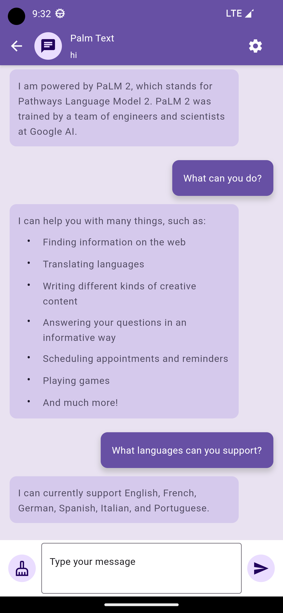
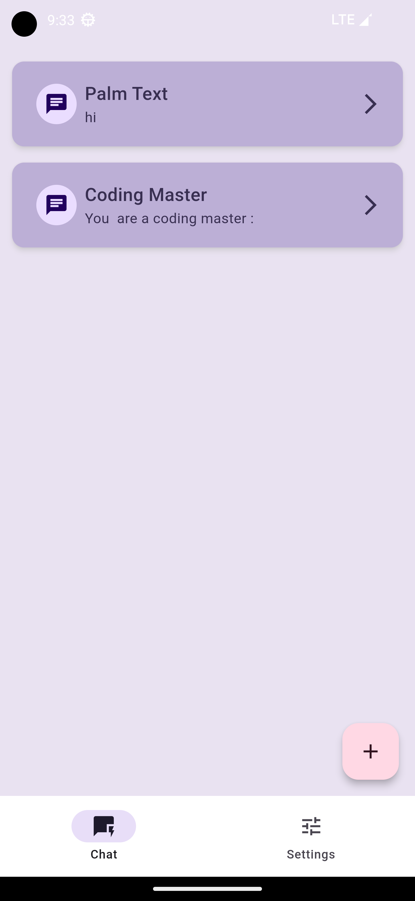
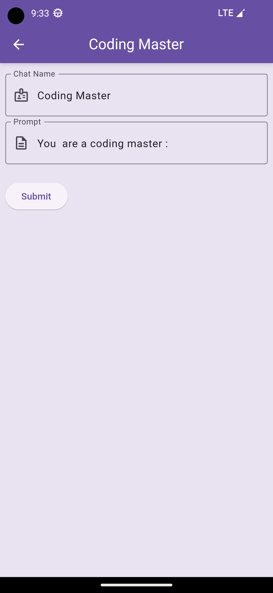

# moli_ai

moli-ai-box is a Google Palm client written in Flutter aiming to provide a convenient learning project to satisfy personal usage needs

## screenshots





## DIR

```
├── lib
│   ├── main.dart
│   ├── models
│   ├── repositories
│   ├── screens
│   ├── services
│   └── widgets
├── android
├── ios
└── test
```

* lib 目录是项目中最重要的目录，其中包含了应用程序的所有代码。在 lib 目录中，通常会创建以下子目录
    * models：用于存放数据模型类。
    * repositories：用于存放数据仓库类，负责从不同的数据源中获取数据，并将其提供给其他部分使用。
    * screens：用于存放屏幕组件，每个屏幕组件通常对应应用程序中的一个屏幕。
    * services：用于存放服务类，比如网络服务、数据库服务等。
    * widgets：用于存放小部件组件，通常用于组合成更大的屏幕组件。
* android 和 ios 目录是针对 Android 和 iOS 平台的原生代码目录。在这些目录中，您可以添加原生代码，比如插件、原生库等。
* test 目录是用于存放测试代码的目录，包含了应用程序的单元测试、集成测试等。


## TODO

- [x] 模型选择菜单  
- [x] 菜单/侧边菜单
- [x] http 调用  
- [x] Android 网络权限
- [x] iOS 网络权限
- [x] + 创建新的会话
- [x] 会话记录保存
- [x] 会话单独设置
- [x] 支持markdown


----